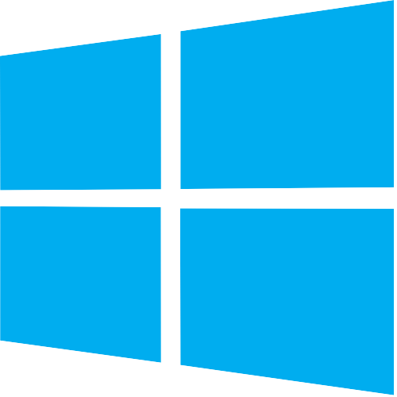

<br />
16 bit operating system written completely from scratch in Assembly x86
## How do I use this
 Instructions for windows: <br />
<b>REQUIREMENTS</b><br />
<ul>
  <li>NASM for Windows</li>
  <li>QEMU</li>
</ul>
The source code is very easy to compile.  First you need to go to the directory that nasm works in (usually C:\Program Files\NASM) and then you want to execute the following code: <br /><br />

```> nasm boot_sect.asm -f bin -o boot_sect.bin``` <br />
<i>unless "boot_sect.asm" is in the NASM directory, you'll want to put the complete address.  Same goes for where you want your output file to be.</i>

Next you'll want to run it with QEMU.  You can try other programs but QEMU is the only one that has worked so far.  Make sure to move your compiled bootloader (.bin) into your qemu folder (usually C:\Program Files\qemu)<br />
Then, assuming you have qemu all set up, you can use the following command: <br />

```> qemu-system-x86_64.exe boot_sect.bin``` <br />
If your compiled bootloader isn't named "boot_sect" you would replace it with whatever the file is named.<br /><br />
 Instructions for Termux:<br />
<b>REQUIREMENTS</b><br />
<ul>
  <li>TigerVNC</li>
  <li>VNC VIEWER</li>
  <li>QEMU(x86_64)</li>
  <li>OPTIONAL: NASM</li>
</ul>
For those who want to use emulate LandOS on a Termux-friendly device will need a few different resources.  This requires a good couple of steps but is a lot easier the second time.  First you're going to want to install the neccessary packages.  We'll install Termux's X11 repo first<br /><br />

```> pkg install x11-repo```<br />
Once thats finished, we'll install TigerVNC<br /><br />
```> pkg install TigerVNC```<br />

Finally, we want to install QEMU (Specifically x86_64)<br />< br/>

```> pkg install qemu-system-x86_64```<br />

Now we Have our neccessary packages and we can begin setting up our enviroment.  First you'll need to be sure to navigate to the directory where the image you want to use is stored.  Then you'll want to start rhe server using:<br />

```> vncserver -localhost```<br/>
If this is TigerVNC's first time setting up a VNC server, you'll be prompted to set up a VNC server password.  Once it is finished, assuming you only have one enviroment running, you can export the display to the VNC server using:<br /><br />

```> export DISPLAY=":1"```<br />
We have set up our display, but nothing is running.  It's because we havent started up anything with graphical output yet.  Once we start up QEMU, we can set up VNC Viewer.  To set up our VM, we use one command <br />

```> qemu-system-x86_64 boot_sect_1_4.bin```<br />
This starts the VM.  And we will now swtitch over to our VNC Viewer app.  We are going to create a new connection.  The first step is opening the app and pressing the green button.  The address will be 127.0.0.1:5901, and you can give it whatever name you want.  I prefer Termux because I use VNC Viewer for just LandOS.  127.0.0.1 is the localhost IP address and the port, 5901, is the port we will be connecting to.  If you are pushing your display to something other than process 1 (":1"), than the last number lf the port will be the process number.  For example:  You pushed your display to process 5(":5").  The last number in the port will be 5.  Thus, making the port 5905.  <br /><br />
Our VNC connection is now all set up.  Now all we need to do is connect to the display and enter your password.  Then, you can interact with the OS at your own will.<br /><br />
When you are finished you can simply close the VNC app, CTRL + C in Termux and type<br />

```> vncserver -kill :1 <----- Or whatever process it is ```<br /><br />

OPTIONAL:  Assembling the source code is rather simple.  First, navigate to the "src" directory.  Then, use the command:<br />

```> nasm boot_sect.asm -f bin -o boot_sect.bin```<br />
This creates the binary file you can run in QEMU.  Remember, this is completely optional.  As you are given an already assembled .bin file in the "images" directory.

